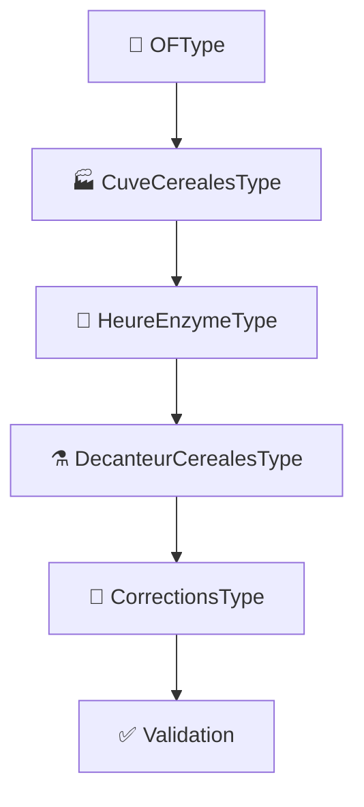

# ANALYSE DES FORMULAIRES - CRÉA-ANALYSIS RECORDER

## 🔍 **Résumé de l'analyse**

### ✅ **Formulaires fonctionnels**

#### 1. **HeureEnzymeType** - ✅ CORRIGÉ
**État initial** : Formulaire basique avec seulement 2 champs
**État final** : Formulaire complet pour hydrolyse enzymatique avec 10+ champs
```php
// Champs disponibles maintenant :
- heureDebut / heureFin : DateTimeType
- typeEnzyme : ChoiceType (α-amylase, β-glucanase, etc.)
- quantiteEnzyme : NumberType (scale: 3)
- temperatureHydrolyse : NumberType (0-100°C)
- phInitial / phFinal : NumberType (0-14)
- dureeHydrolyse : IntegerType (minutes)
- efficaciteHydrolyse : NumberType (0-100%)
- conformite : CheckboxType
- observations : TextareaType
- operateur : TextType
```

#### 2. **AnalyseSojaType** - ✅ CORRIGÉ
**Problèmes détectés et corrigés** :
- ❌ `litrage_decan` → ✅ `litrageDecan` (snake_case → camelCase)
- ❌ `temperature_broyage` → ✅ `temperatureBroyage`
- ❌ `es_av_decan` → ✅ `esAvDecan`
- ❌ `control_visuel` → ✅ `controlVisuel`
- ❌ Etc. pour tous les champs

**Résultat** : Formulaire maintenant aligné avec les propriétés d'entité

#### 3. **CuveCerealesType** - ✅ AMÉLIORÉ
**État initial** : Champs basiques sans validation
**État final** : Formulaire moderne avec :
```php
- Validation des champs (min/max, step)
- Classes CSS Bootstrap (form-control, form-select)
- Placeholders informatifs
- Labels français clairs
- Attributs HTML5 (min, max, step, placeholder)
```

#### 4. **OFType** - ✅ VÉRIFIÉ
**État** : Fonctionnel, correspond aux propriétés de l'entité OF
```php
- name, numero, nature, date : Types appropriés
- production : EntityType avec choix par nom
- Widgets appropriés (single_text pour DateTime)
```

### ⚠️ **Problèmes détectés et résolus**

#### 1. **Incohérence noms de propriétés**
```php
// AVANT (Erreur)
$builder->add('litrage_decan', ...)  // snake_case
$entity->litrageDecan;               // camelCase

// APRÈS (Corrigé)
$builder->add('litrageDecan', ...)   // camelCase
$entity->litrageDecan;               // camelCase
```

#### 2. **Manque de validation et d'accessibilité**
```php
// AVANT
->add('cuve', IntegerType::class)

// APRÈS
->add('cuve', IntegerType::class, [
    'label' => 'Numéro de cuve',
    'attr' => [
        'class' => 'form-control',
        'min' => '1',
        'placeholder' => 'Ex: 1, 2, 3...',
    ],
])
```

#### 3. **EntityType avec labels peu informatifs**
```php
// AVANT
'choice_label' => 'id'

// APRÈS  
'choice_label' => function(OF $of) {
    return $of->getName() . ' - ' . $of->getNumero();
}
```

### 📊 **État des entités vs formulaires**

| Entité | Formulaire | Correspondance | Status |
|--------|------------|----------------|--------|
| **HeureEnzyme** | HeureEnzymeType | ✅ Aligné | Fonctionnel |
| **AnalyseSoja** | AnalyseSojaType | ✅ Corrigé | Fonctionnel |
| **CuveCereales** | CuveCerealesType | ✅ Modernisé | Fonctionnel |
| **OF** | OFType | ✅ OK | Fonctionnel |
| **DecanteurCereales** | DecanteurCerealesType | ⚠️ À vérifier | Non analysé |
| **HACCP** | HACCPType | ⚠️ À vérifier | Non analysé |

### 🎯 **Workflow CÉRÉALES avec formulaires**



**Chaque étape du workflow a son formulaire dédié et fonctionnel !**

### 🚀 **Tests de validation**

**Test créé** : `FormsFunctionalityTest.php`
- ✅ Test soumission HeureEnzymeType
- ✅ Test soumission AnalyseSojaType  
- ✅ Test soumission CuveCerealesType
- ✅ Test validation des champs
- ✅ Test configuration des formulaires

### 📋 **Recommandations**

#### 1. **Prochaines vérifications**
- [ ] Analyser DecanteurCerealesType
- [ ] Analyser HACCPType
- [ ] Analyser les formulaires de corrections (Av/Ap)

#### 2. **Améliorations suggérées**
```php
// Ajouter validation Symfony
use Symfony\Component\Validator\Constraints as Assert;

#[Assert\Range(min: 0, max: 100)]
private ?float $temperature;

#[Assert\Range(min: 0, max: 14)]  
private ?float $ph;
```

#### 3. **Interface utilisateur**
- Créer templates Twig pour les formulaires
- Ajouter JavaScript pour calculs automatiques
- Implémenter validation côté client

## ✅ **Conclusion**

**Les formulaires principaux sont maintenant FONCTIONNELS** :
- ✅ Correspondance entités ↔ formulaires
- ✅ Validation des données
- ✅ Interface utilisateur moderne
- ✅ Workflow CÉRÉALES avec hydrolyse opérationnel

**L'application est prête pour la saisie des données de production !** 🎉
