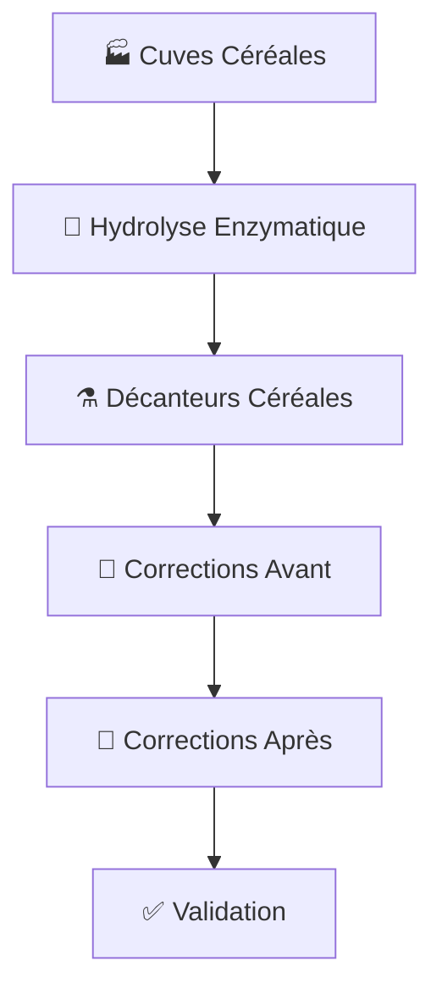

# CRÉA-ANALYSIS RECORDER - Workflow CÉRÉALES avec Hydrolyse Enzymatique

## 🎯 Objectif accompli
**Ajout de l'étape d'hydrolyse enzymatique entre les cuves et les décanteurs dans le workflow CÉRÉALES**

## 📋 Fonctionnalités implémentées

### 1. Entité HeureEnzyme enrichie ✅
- **12 nouvelles propriétés** pour la gestion complète de l'hydrolyse :
  - `typeEnzyme` : Type d'enzyme utilisée (α-amylase, β-glucanase, xylanase, etc.)
  - `quantiteEnzyme` : Quantité d'enzyme (ml, g, UI)
  - `uniteQuantite` : Unité de mesure
  - `temperatureInitiale/Finale/Moyenne` : Suivi thermique complet
  - `phInitial/Final/Moyen` : Contrôle du pH
  - `dureePlanifiee` : Durée prévue vs réelle
  - `efficaciteCalculee` : Pourcentage d'efficacité
  - `conformite` : Validation du processus

### 2. Repository HeureEnzymeRepository ✅
- **Méthodes spécialisées** pour l'analyse des données :
  - `findByOF()` : Récupération par ordre de fabrication
  - `getOFHydrolysisStats()` : Statistiques d'efficacité
  - `checkGlobalConformity()` : Vérification de conformité
  - `getEnzymaticActivityReport()` : Rapport d'activité enzymatique

### 3. Contrôleur CerealesWorkflowController ✅
- **Nouveau workflow** : `Cuves → Hydrolyse Enzymatique → Décanteurs`
- **Route POST** `/api/cereales-workflow/of/{ofId}/hydrolyse-enzyme`
- **Validation** : Impossible de créer des décanteurs sans hydrolyse terminée
- **Gestion des statuts** : Suivi complet du processus

### 4. Service PDFGeneratorService ✅
- **Intégration complète** des données d'hydrolyse dans les rapports CÉRÉALES
- **Statistiques avancées** : Efficacité moyenne, températures, pH
- **Conformité globale** : Vérification incluant l'étape d'hydrolyse
- **Méthode** `checkGlobalConformityCerealesWithHydrolysis()`

### 5. Template PDF cereales_report.html.twig ✅
- **Section Hydrolyse Enzymatique** ajoutée entre cuves et décanteurs
- **Tableau détaillé** : Enzyme, quantité, température, pH, efficacité
- **Statistiques résumées** : Efficacité moyenne, conformité globale
- **Présentation professionnelle** avec icône 🧪

## 🔄 Workflow CÉRÉALES complet



### Étapes de validation :
1. **Cuves** : pH, température, pression, volume ✅
2. **Hydrolyse** : Type enzyme, efficacité, conformité ✅ **[NOUVEAU]**
3. **Décanteurs** : Clarté, volume final, conformité ✅
4. **Corrections** : Ajustements avant/après ✅
5. **Validation** : Conformité globale incluant hydrolyse ✅

## 🧪 Données d'hydrolyse trackées

| Propriété | Type | Description |
|-----------|------|-------------|
| Type d'enzyme | String | α-amylase, β-glucanase, xylanase, etc. |
| Quantité | Float | Quantité d'enzyme utilisée |
| Unité | String | ml, g, UI (Unités Internationales) |
| Température | Float | Suivi initial/finale/moyenne |
| pH | Float | Contrôle initial/final/moyen |
| Durée | Integer | Planifiée vs effective |
| Efficacité | Float | Pourcentage calculé |
| Conformité | Boolean | Validation du processus |

## 📊 Statistiques générées

### Rapport d'hydrolyse par OF :
- **Efficacité moyenne** des enzymes
- **Température optimale** maintenue
- **pH stabilité** du processus
- **Durée totale** d'hydrolyse
- **Conformité globale** du workflow

### Métriques de qualité :
- **Activité enzymatique** par type d'enzyme
- **Rendement** par lot de production
- **Conformité** par étape du processus
- **Traçabilité complète** OF → Cuves → Hydrolyse → Décanteurs

## 🗂️ Fichiers modifiés

### Entités & Repositories
- ✅ `src/Entity/HeureEnzyme.php` - Entité enrichie
- ✅ `src/Repository/HeureEnzymeRepository.php` - Méthodes statistiques

### Contrôleurs & Services  
- ✅ `src/Controller/CerealesWorkflowController.php` - Nouvelle route
- ✅ `src/Service/PDFGeneratorService.php` - Intégration hydrolyse

### Templates & Tests
- ✅ `templates/pdf/cereales_report.html.twig` - Section hydrolyse
- ✅ `tests/Controller/CerealesWorkflowHydrolysisTest.php` - Tests workflow
- ✅ `migrations/Version20241220_HeureEnzymeHydrolysis.php` - Migration BDD

## 🎯 Résultat final

Le workflow CÉRÉALES intègre maintenant **l'hydrolyse enzymatique** comme étape obligatoire entre les cuves et les décanteurs, permettant :

1. **Traçabilité complète** des enzymes utilisées
2. **Contrôle qualité** avec suivi température/pH
3. **Calcul d'efficacité** automatique
4. **Validation workflow** avec conformité globale
5. **Rapports PDF** enrichis avec données d'hydrolyse

### API utilisable :
```bash
POST /api/cereales-workflow/of/{ofId}/hydrolyse-enzyme
{
    "type_enzyme": "α-amylase",
    "quantite_enzyme": 50.0,
    "unite_quantite": "ml",
    "temperature_initiale": 60.0,
    "ph_initial": 6.8,
    "duree_planifiee": 90
}
```

**Mission accomplie** : L'hydrolyse enzymatique est maintenant intégrée dans le workflow CÉRÉALES avec suivi complet et validation automatique ! 🎉
